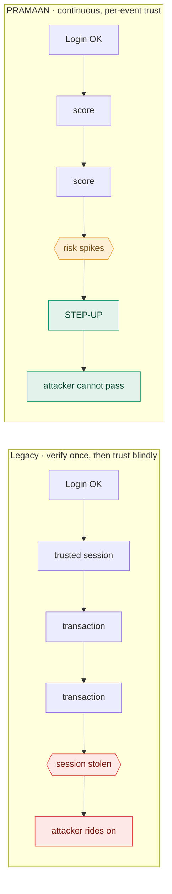
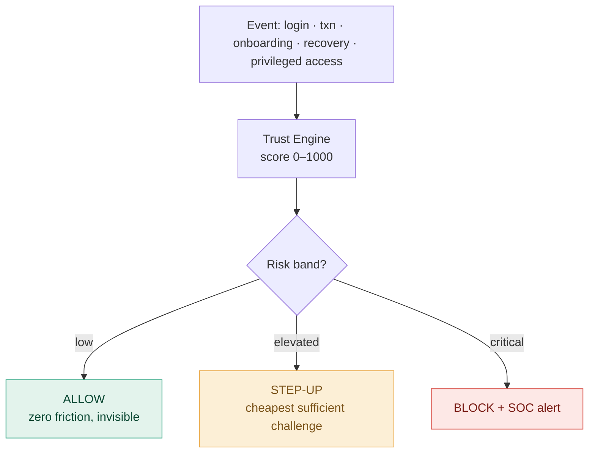
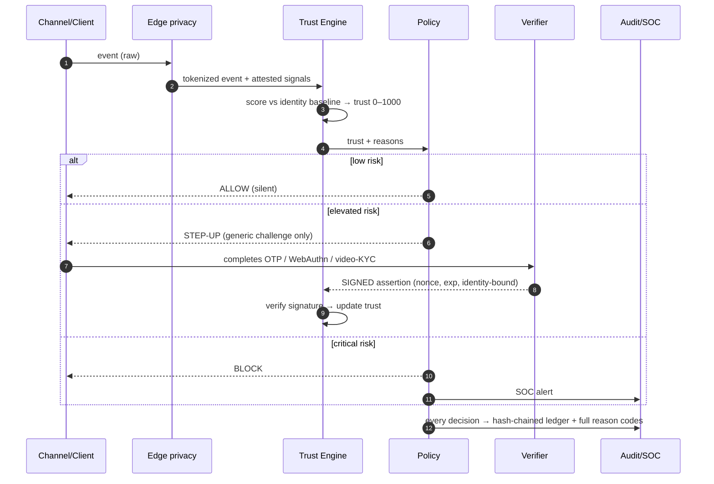

<div align="center">

&nbsp;&nbsp;&nbsp;&nbsp;&nbsp;&nbsp;

# PRAMAAN

### Continuous Identity Trust for Banking

*Privacy-first · Risk-Adaptive · Multi-channel Authentication & Anomaly Network*

**PSB Hackathon Series 2026 · Bank of Baroda · Cybersecurity & Fraud · Theme: Identity Trust, Protection & Safety**

[](https://github.com/ayushtiwary-ops/BankOfBaroda-IIT-Gn/actions/workflows/ci.yml)
[](https://github.com/ayushtiwary-ops/BankOfBaroda-IIT-Gn/actions/workflows/ci.yml)
[](#9-reproduce-every-number)
[](#7-privacy--compliance-in-code)
[](LICENSE)

*Pramāṇ* (प्रमाण) is Sanskrit for **proof**. PRAMAAN continuously proves that the person behind every
digital banking session is who they claim to be, in real time, **without ever holding their raw personal
data** and without adding friction for genuine users.

</div>

> **On 31.3 million real logins, PRAMAAN catches 93% of account takeovers while challenging only 2% of
> genuine users (and 0% of genuine new users). On mobile-money fraud it catches 100% of mule cash-outs at
> a 1% step-up rate.** Every number in this README regenerates from the repository with one command:
> `python scripts/check_headline.py`.

---

## What a judge can do in 30 seconds

```bash
git clone https://github.com/ayushtiwary-ops/BankOfBaroda-IIT-Gn.git && cd BankOfBaroda-IIT-Gn
docker compose -f infra/docker-compose.yml up --build -d # Kafka + Redis + Postgres + pods + verifier + ingress
python scripts/e2e_smoke.py # one event flows Kafka -> pod -> decision -> audit
open http://localhost:8090 # live dashboard (attack it)
```

No real secrets are needed: the compose file ships clearly labelled demo values and the dashboard lets you
fire events and watch the trust score, the decision, and the SOC reason codes update live. Prefer the
numbers first? Run `python -m pytest -q` (84 tests) and `python scripts/check_headline.py` (the drift gate).

---

## Table of contents

1. [The problem](#1-the-problem)
2. [The idea in one picture](#2-the-idea-in-one-picture)
3. [Architecture](#3-architecture)
4. [Runtime workflow](#4-runtime-workflow)
5. [The five detections, on real data](#5-the-five-detections-on-real-data)
6. [The trust boundary (our core security idea)](#6-the-trust-boundary)
7. [Privacy & compliance, in code](#7-privacy--compliance-in-code)
8. [Quickstart](#8-quickstart)
9. [Reproduce every number](#9-reproduce-every-number)
10. [Repository structure](#10-repository-structure)
11. [Results](#11-results)
12. [Security hardening & threat model](#12-security-hardening)
13. [Roadmap](#13-roadmap)
14. [Team & acknowledgements](#14-team--acknowledgements)

---

## 1. The problem

Banks verify identity once, at the front door (login or OTP), and then trust the whole session. Attackers
exploit exactly that gap: account takeover after credential theft, SIM-swap-driven account recovery,
mule-account onboarding, and insiders abusing privileged access. The risk almost always appears **after**
login and evolves **during** the session. Adding more checks for everyone destroys customer experience;
adding none invites fraud.



---

## 2. The idea in one picture

Every identity, customer **or** employee, carries a live **Trust Score (0–1000)**. Every event is scored
in real time against that identity's own behavioural baseline. The vast majority of events sail through
silently; verification fires only when risk is elevated, and the challenge chosen is the least intrusive
method that covers the risk.



Trust decays on risk and recovers **only** through verified, normal behaviour, and never faster than it
falls. That single rule is what defeats slow baseline-poisoning attacks (see §12).

---

## 3. Architecture

Four layers, each with one job, separated by an explicit **trust boundary**. Everything to the left of the
boundary is untrusted input; the engine only ever acts on what it can verify itself.

```mermaid
flowchart LR
    subgraph CH[Digital channels]
        c1[Mobile app]; c2[Internet banking]; c3[Branch]; c4[Open API]; c5[Admin console]
    end

    subgraph TB[" TRUST BOUNDARY · what the server is allowed to believe "]
        direction LR
        subgraph EDGE["① Edge privacy layer"]
            e1[HMAC-tokenize IDs]; e2[geo → coarse bucket]; e3[on-device biometric → score]; e4[device attestation]; e5[DP-noised export]
        end
        subgraph ENG["② Identity Trust Engine"]
            g1[Unsupervised anomaly model]; g2[Weighted explainable features · SHAP]; g3[Continuous Trust 0–1000<br/>decay / capped recovery]
        end
        subgraph POL["③ Policy orchestrator"]
            p1[ALLOW]; p2[STEP-UP]; p3[BLOCK]
        end
        subgraph VER["④ Verifier"]
            v1[Signed assertion<br/>OTP · WebAuthn · video-KYC]
        end
    end

    AUD["⑤ Tamper-evident audit & SOC plane<br/>SHA-256 hash chain · reason codes + SHAP + counterfactual · crypto-shredding"]

    CH --> EDGE --> ENG --> POL
    POL -. "STEP-UP".-> VER
    VER == "signed outcome updates trust (never a client boolean)" ==> ENG
    POL --> AUD
    ENG --> AUD
```



State is externalized (Redis) and events are partitioned by identity (Kafka), so scoring pods are
stateless and scale horizontally. Per-request scoring latency is **~5 ms p99 (measured)**.

---

## 4. Runtime workflow

One event, end to end. The only path that can **raise** trust is a signed outcome from the verifier.



The classic failure mode `POST /stepup?verified=true` is **structurally impossible**: the endpoint accepts
only a signed, fresh, nonce-bound assertion validated server-side. The client never asserts its own outcome.

---

## 5. The five detections, on real data

Each mandated detection is proven on the closest public, labelled dataset, with temporal splits, leakage
guards, and ablations throughout. Nothing is synthetic; no number is unsourced.

| # | Detection (mandated) | Dataset · scale | Headline result | Honest caveat |
|---|---|---|---|---|
| 1 | Anomalous behaviour (behavioural biometrics) | CMU keystroke · 51 users, 20.4K reps | **mean EER 0.0955** (lit. 0.096) | per-user enrollment; password-specific |
| 2 | New-device usage / device trust | IEEE-CIS · 590K txns | **PR-AUC 0.69** on device flows; +2.4 pts recall@1% from device columns | ~24% of txns carry device data |
| 3 | Suspicious onboarding / mule | PaySim · 6.36M txns | **100%** mule cash-outs caught @ 1% step-up (vs bank rule 0.5%) | PaySim is cleanly separable |
| 4 | Suspicious account recovery / ATO | RBA / Wiefling · 31.3M logins (6.79M-login held-out test) | **93%** of ATO caught @ 2% step-up, **87.5%** @ 1% (ROC 0.993) | tiny positive class → recall-at-budget with bootstrap CI |
| 5 | Privileged-access misuse / insider | CERT r4.2 · 1,000 users, 70 insiders | **100%** of IP-theft insiders @ 10 alerts/day | scenario-1 needs the excluded proxy feed |

Two findings worth stating out loud: behavioural risk scoring catches **93% of ATO at a 2% step-up** while a
raw IP-reputation blocklist catches **0%** at the same budget; and IEEE-CIS fraud runs **7.85%** on
device-bearing flows versus **2.09%** without, a 3.7× concentration the model focuses on.

---

## 6. The trust boundary

Most submissions never ask *what the server is allowed to believe*. PRAMAAN draws that line explicitly and
enforces it in code:

1. **No client-trusted inputs.** The engine never accepts a trust or behaviour score the client computed
   about itself. Signals are device-attested or recomputed server-side.
2. **Outcomes are signed.** Step-up success arrives as a fresh, nonce-bound assertion from a trusted
   verifier, validated server-side (Ed25519). A client boolean does nothing.
3. **Reasons stay inside.** Rich reason codes, SHAP values, and counterfactuals go to the SOC and audit
   plane; the client receives only a generic challenge, so the detector is never an oracle for the attacker.

Every endpoint is authenticated and scoped; the identity-lookup IDOR is removed; secrets come from
env/KMS with no shipped defaults. See [`docs/THREAT_MODEL.md`](docs/THREAT_MODEL.md).

---

## 7. Privacy & compliance, in code

Privacy is the centre of this track, so it is an engineering requirement with artifacts behind every claim.

- **Data minimisation:** only tokens and scores cross the trust boundary; raw PII stays at the edge.
- **On-device biometrics:** keystroke/swipe cadence is scored on the device; only one similarity number is transmitted.
- **Differential privacy:** retraining exports pass a real DP mechanism (RDP accountant) at a stated **ε ≈ 1.1, δ = 1e-5** ([`results/privacy_budget.json`](results/privacy_budget.json)).
- **Right-to-erasure vs immutable audit:** reconciled by **crypto-shredding**. The hash chain holds only tokenized references; destroying a per-identity key erases the person while the chain stays verifiable.
- **DPDP Act 2023 & RBI:** data-localisation (raw data stays in-country, never committed), auditable + explainable decisions, fairness audit. See [`docs/COMPLIANCE.md`](docs/COMPLIANCE.md).

---

## 8. Quickstart

```bash
# 1) Run the whole executable architecture (Kafka + Redis + Postgres + scoring pods + verifier + ingress)
docker compose -f infra/docker-compose.yml up --build -d
python scripts/e2e_smoke.py # events flow Kafka → pods → decision → audit

# 2) Or run just the API + live dashboard locally
PRAMAAN_MODE=demo_synthetic uvicorn app.main:app --app-dir backend --port 8000
open http://localhost:8000 # dashboard · http://localhost:8000/docs for the API

# 3) Run the test suite
python -m pytest -q # 84 passing
```

---

## 9. Reproduce every number

```bash
python src/download_data.py --all # fetch + SHA-256 verify (see docs/DATA_SOURCES.md)
python src/train.py # per-detection models · temporal splits · seeded
python src/train_rba_full.py # RBA on the full 31.3M-login dataset (headline RBA numbers)
python src/evaluate.py # PR-AUC · ROC-AUC · P/R @ FPR · detection-vs-step-up curves
python src/eval_full.py all # full metric suite + bootstrap CIs (see docs/EVALUATION.md)
python scripts/check_headline.py # asserts every headline number matches a committed artifact
```

The CI workflow runs the test suite, the model-integrity check, and the headline drift-gate on every push,
so a reviewer who clones the repository reproduces the headline sentence and cannot find a number the
artifacts do not support.

---

## 10. Repository structure

```text.
├── README.md # you are here
├── LICENSE
├── docs/
│ ├── PRAMAAN_Submission.pdf # the architecture & solution document (the submission deliverable)
│ ├── architecture.(svg|png|mmd) # architecture diagram (source + rendered)
│ ├── DATA_SOURCES.md # dataset inventory · license · checksum · detection it proves
│ ├── THREAT_MODEL.md # STRIDE + attack tree, control mapping
│ ├── COMPLIANCE.md # DPDP Act 2023 + RBI mapped to code paths
│ ├── BUSINESS_CASE.md # ₹ ROI with stated assumptions and shown arithmetic
│ └── SECURITY_HARDENING.md # engineering changelog of the security hardening
├── backend/app/ # FastAPI service
│ ├── main.py # endpoints (auth + scoped, signed step-up, crypto-shred erase)
│ ├── risk_engine.py # hybrid scoring + continuous trust
│ ├── verifier.py # Ed25519 signed step-up assertions (the trust boundary)
│ ├── model_loader.py # loads the real trained model (SHA-256 pinned)
│ ├── keystore.py # crypto-shredding PII vault
│ ├── auth.py · config.py · policy.py · features.py · audit.py · drift.py · explain.py · state_store.py
├── src/ # data + ML pipeline (download → train → evaluate → export)
├── simulator/ # attack scenarios incl. attack_low_and_slow.py
├── scripts/ # check_headline.py · e2e_smoke.py · loadtest.py
├── infra/docker-compose.yml # the executable architecture
├── demo/dashboard.html # live console
├── tests/ # 84 tests (security + engine + artifacts)
├── results/ # metrics.json + curves (committed) + model_card.json
├── data/
│ ├── samples/ # small committed samples
│ ├── *.sha256 # checksums (raw data is downloaded, never committed)
│ └──...
└──.github/workflows/ci.yml # tests + model-integrity + headline drift-gate
```

---

## 11. Results

All figures are produced by the reproduce chain above and committed under [`results/`](results/).

- Detection-vs-step-up curves, PR/ROC curves per detection: `results/<run>/`
- Behavioural-biometric EER distribution: `results/cmu_keystroke/`
- Low-and-slow adversarial demo (old caught @ session 19, PRAMAAN @ session 4): `results/adversarial/`
- Differential-privacy budget: `results/privacy_budget.json`
- Fairness audit: `results/fairness/report.json`
- Load test (latency histogram, concurrency sweep): `results/load/`
- Machine-readable headline: regenerated and checked by `scripts/check_headline.py`

---

## 12. Security hardening

PRAMAAN was put through an adversarial internal security review; every high-severity finding was fixed before submission,
each backed by a red→green test:

| Flaw | Fix | Test |
|---|---|---|
| Step-up trusted a client boolean | Ed25519 signed verifier assertion | `test_valid_signed_assertion_is_accepted` |
| Client-supplied behaviour score | device-attested, server-verified | `test_unsigned_high_score_is_treated_missing` |
| Model trained on synthetic noise | real RBA-trained model, SHA-256 pinned | `test_prod_refuses_to_start_without_artifact` |
| Open API / IDOR | auth + per-caller scopes; lookup removed | `test_idor_identity_lookup_requires_soc_scope` |
| Reason codes leaked to client | SOC-only; generic challenge to client | `test_reasons_only_on_soc_never_on_client` |
| Erasure vs immutable audit | crypto-shredding (destroy key, chain intact) | `test_crypto_shred_makes_material_irrecoverable` |
| Baseline poisoning (low-and-slow) | capped trust recovery + drift detection | `test_drift_detector_flags_sustained_subthreshold_rise` |

Full detail in [`docs/SECURITY_HARDENING.md`](docs/SECURITY_HARDENING.md) and [`docs/THREAT_MODEL.md`](docs/THREAT_MODEL.md).

---

## 13. Roadmap

- **Now:** real metrics on five datasets, hardened service, executable architecture, reproducibility gate.
- **Next:** public, rate-limited, attackable demo URL; multi-pod distributed load proof (k6).
- **Finals:** federated DP-SGD behavioural model; full-data (non-sampled) end-to-end regeneration; quantified BoB-scale ₹ business case.

---

## 14. Team & acknowledgements

**Team Paritran**

- **Ayush Tiwary** is Founder of Kriseva AI Pvt Ltd (India's defence-procurement intelligence layer). Grand finalist, Pan-IIT *AI for Bharat* Hackathon. One year as Operations Manager at Zen Technologies.
- **Aditya Arora** won the University of London Sustainable AI Solutions Hackathon 2026. Built enterprise-grade agentic-AI and RAG systems (*Agent Pyro*, an agentic-AI attack detector). 1.5 years as a software developer at Capgemini.

**Datasets** (used within their licenses; full provenance in [`docs/DATA_SOURCES.md`](docs/DATA_SOURCES.md)):
RBA login dataset (Wiefling et al., ACM TOPS 2022, Zenodo 6782156, CC BY 4.0); PaySim (Lopez-Rojas et al.,
2016); IEEE-CIS Fraud Detection (Vesta, Kaggle); CMU keystroke dynamics (Killourhy & Maxion, DSN 2009);
CMU CERT Insider Threat r4.2.

Built for the **Bank of Baroda · PSB Hackathon Series 2026**, organised with **IIT Gandhinagar**.

## License

Released under the [MIT License](LICENSE). Dataset licenses are retained by their respective owners.
